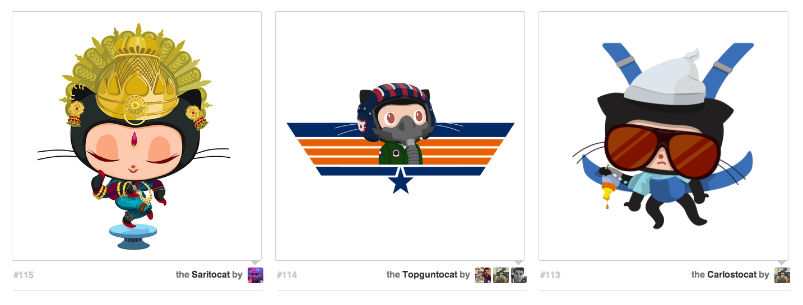

## Octodex!

An intro to HTML/CSS and layout.

This homework is due by 9am on Thursday, 03/17/2016.

## Description

CSS Layout is one of the most fundamental things to know in web design.

Fork and clone the [octodex][octodex] repo, take the unstyled HTML
and add CSS styling to create an attractive layout.

[octodex]: https://github.com/TIY-ATL-ROR-2016-Feb/octodex

## Objectives

### Learning Objectives

After completing this assignment, you should…

* Be able to place any element on a page where you want it.
* Understand HTML/CSS Layout

### Performance Objectives

After completing this assignment, you be able to effectively use

* Use CSS Floats
* Use CSS Positioning

## Details

### Deliverables

* A link to an octodex repo containing at least:
  * `main.css`
  * `index.html`
  * `Readme.md`

## Normal Mode

Check out a `gh-pages` branch. On that branch:

* Write a `main.css` file to make the *provided* HTML look the same as [octodex.png](./octodex.png)

Once you're finished, push to the gh-pages branch and view your page at `https://your-username.github.io/octodex`. Submit the Github Pages link as the result of the assignment.

## Additional Resources

- [Learn CSS Layout](http://learnlayout.com/)
- [CSS Triangle Generator](http://apps.eky.hk/css-triangle-generator/)
